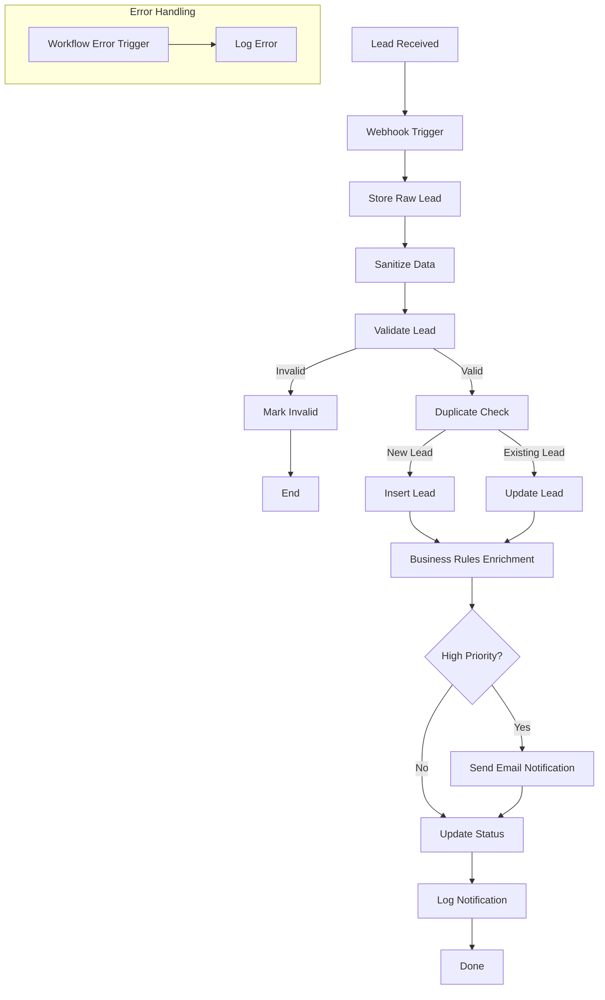

# Real Estate Lead Intake Automation System

Production-oriented n8n workflow that receives inbound real estate leads, validates and enriches them, prevents duplicates, stores them in PostgreSQL, and notifies sales teams in real time.

## Business Problem

Real estate agencies receive leads from websites, Facebook Ads, landing pages, and property portals.

Many teams still process these leads manually:

- Copy information into a CRM
- Check for duplicates
- Notify agents
- Prioritize urgent buyers
- Update spreadsheets

This leads to slow response times, duplicate records, and missed opportunities.

This workflow automates the intake process while improving data quality and reducing manual work.

## Solution

This automation receives every new lead through an n8n Webhook and processes it automatically.

The workflow:

- sanitizes incoming data
- validates required fields
- detects duplicates
- inserts or updates PostgreSQL
- enriches the lead
- notifies the sales team
- logs failures using a centralized Error Handler workflow

## Results

- Automatically validates incoming real estate leads before processing.
- Prevents duplicate records using multiple matching strategies.
- Sends real-time email notifications for qualified and high-priority leads.
- Centralizes workflow error logging for easier monitoring and troubleshooting.
- Reduces manual data entry and improves lead response efficiency.

## Features

- Webhook Lead Intake
- Data Sanitization
- Validation
- Duplicate Detection
- PostgreSQL Integration
- Insert / Update Logic
- Business Rules Enrichment
- Email Notifications
- Centralized Error Handling
- Production-ready Workflow Structure

## Workflow


### Complete Workflow


## Tech Stack

- n8n
- PostgreSQL
- Docker
- Gmail
- JavaScript (Code Nodes)
- REST APIs

## Repository Structure

```text
real-estate-lead-intake-system/
├── database/
│   ├── 001_schema.sql              # Database schema
│   ├── 002_indexes.sql             # Performance indexes
│   ├── 003_notification_logs.sql   # Notification logging
│   └── 004_error_logs.sql          # Error logging
│
├── docs/
│   ├── architecture.md             # System architecture
│   ├── workflow-overview.md        # Workflow explanation
│   └── screenshots/                # Project screenshots
│
├── examples/
│   ├── valid-lead.json
│   ├── duplicate-lead.json
│   ├── invalid-lead.json
│   └── high-priority-lead.json
│
├── workflows/
│   └── Real Estate Lead Intake & Qualification System.json
│
├── docker-compose.yml              # PostgreSQL container
├── .env.example                    # Environment variables template
├── README.md
└── LICENSE
```

## Example Payload

Example of a valid lead received by the webhook:

```json
{
  "first_name": "Youssef",
  "last_name": "El Mansouri",
  "email": "youssef.elmansouri+004@example.com",
  "phone": "+212661778845",
  "location": "Rabat",
  "lead_type": "buyer",
  "property_type": "villa",
  "budget": 4800000,
  "currency": "MAD",
  "timeline": "Within 2 months",
  "source": "website",
  "source_lead_id": "WEB-20260724-005",
  "message": "My family is relocating to Rabat. We're looking for a 4-bedroom villa with a garden in Hay Riad. We'd like to schedule a viewing as soon as possible.",
  "preferred_contact_method": "phone",
}
```


Additional test payloads are available in the `/examples` directory for:

- Valid lead
- Duplicate lead
- Invalid lead
- High-priority lead

## How to Run

### Prerequisites

- Docker Desktop
- n8n
- PostgreSQL
- Gmail account (or another email provider) for notifications

### 1. Clone the repository

```bash
git clone https://github.com/<your-username>/real-estate-lead-intake-system.git
cd real-estate-lead-intake-system
```

### 2. Start PostgreSQL

```bash
docker compose up -d
```

### 3. Create the database

Run the SQL scripts in the `database/` folder in order:

1. `001_schema.sql`
2. `002_indexes.sql`
3. `003_notification_logs.sql`
4. `004_error_logs.sql`

### 4. Configure environment variables

Copy the example configuration:

```bash
cp .env.example .env
```

Update the values to match your local environment.

### 5. Import the workflow

Open n8n and import:

```
workflows/Real Estate Lead Intake & Qualification System.json
```

### 6. Configure credentials

Create or update the required credentials in n8n:

- PostgreSQL
- Gmail

### 7. Test the workflow

Use one of the sample payloads from the `examples/` folder and send it to the webhook endpoint.

Verify that:

- The payload is validated and sanitized.
- New leads are inserted or existing leads are updated.
- Email notifications are sent.
- Errors are logged by the Error Handler workflow.

## Current Limitations

This portfolio project currently does not include:

- CRM integration (HubSpot)
- SMS automation
- AI lead scoring
- Scheduled follow-up sequences
- Consent management
- Reply detection

## Planned Improvements

- HubSpot Integration
- Twilio SMS
- AI Lead Scoring
- Follow-up Automation
- Consent Management
- Dashboard
- Analytics